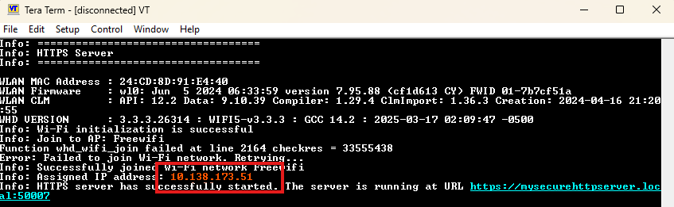

### HTTPS Protocol Basics
|# | Component| Role |
| :--- | :--- | :--- |
| 1| Google | HTTP Server |
| 2 | Browser + HTM Page | HTTP Client |
| 3 | Internet | Transport Medium |

Who is the HTTP Server?
➡ HTTP Server = Google servers (google.com infrastructure)

Who is the HTTP Client?
➡  Your Web Browser (Chrome / Firefox / Edge / Mobile browser) that runs html page.

### Modify the code as below:
|# | File| Line Number | Change needs to be made |
| :--- | :--- | :--- |:--- |
| 1| secure_http_server.h | 59 | Set WIFI_SSID = Your hotspot name |
| 2 | secure_http_server.h | 60 | WIFI_PASSWORD = Your hotspot password |
| 3 | secure_http_server.c | 461 | Replace `&security_config` with `NULL` |

### How to open webpage
Open : http://10.138.173.51:50007

**Where did I get this IP address?**

