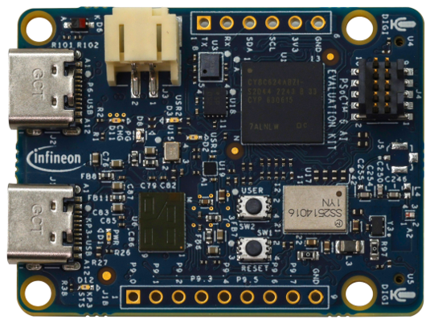

### Sense CE
1. Request every one to take a paper. 
2. Write as below (leave a gap in the middle to keep your kit)

```
                                TOP
                    	         ↑
                        


            LEFT←                                 →RIGHT


                                 ↓
                                BOTTOM

```
3. Rotate and analyse what is the top view
4. Keep the kit in the middle (in the gap)


|                   | TOP                                 |                 |
|--------------------------------------|---------------------------------------------|------------------------------------|
| **LEFT**|  | **RIGHT** |
|                   |  <div align="center">**BOTTOM**</Div>                              |                 |

### Modify the code as below:
|# | File| Line Number | Change needs to be made |
| :--- | :--- | :--- |:--- |
| 1| motion_task.h  | 73 | INTERFACE_USED   CY8CKIT_062S2_AI |

5. Now see what the Tera term displays the same that you just said. WoooooW... The job of your brain is done by the PSOC6 micro controller, making use of the sensors available.


